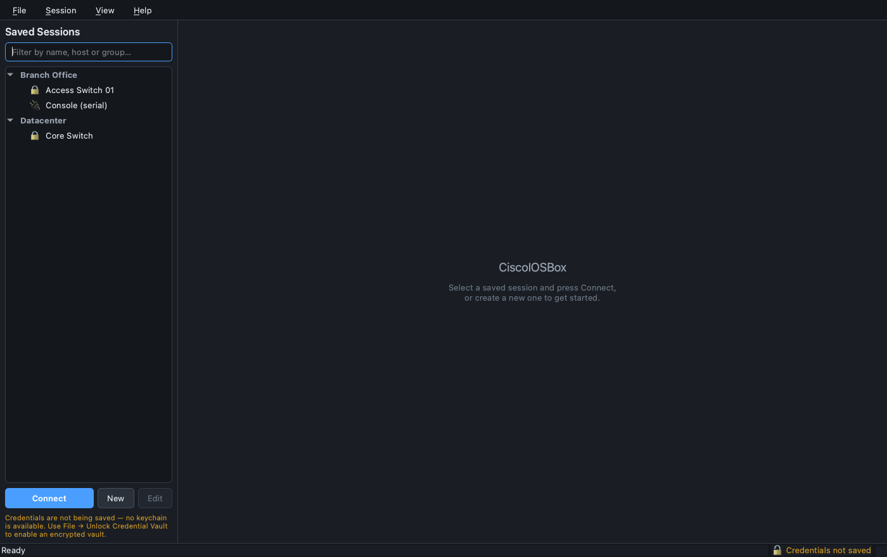
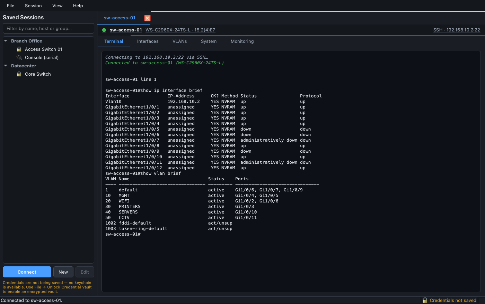
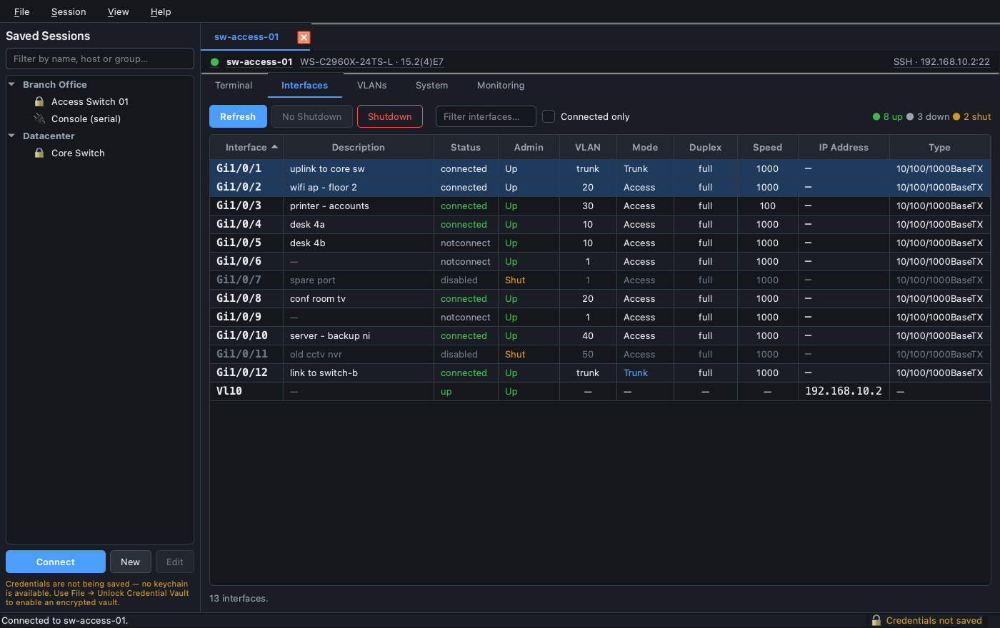
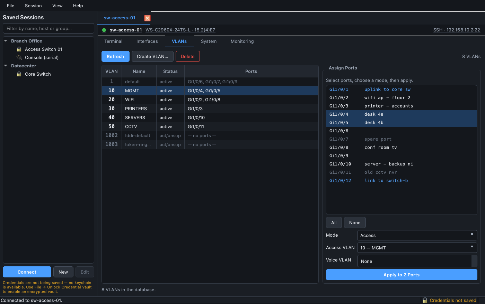
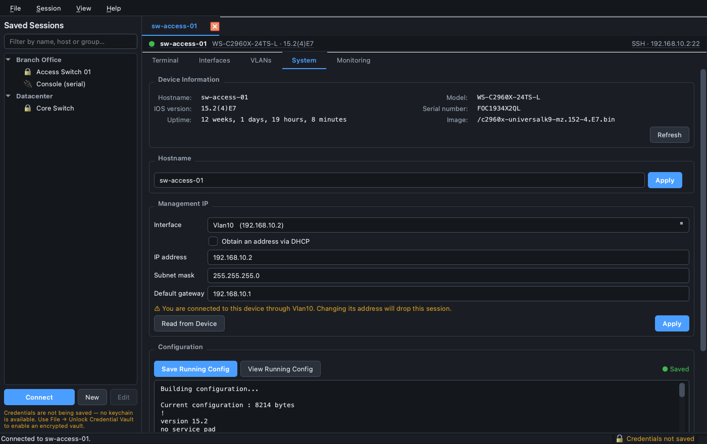
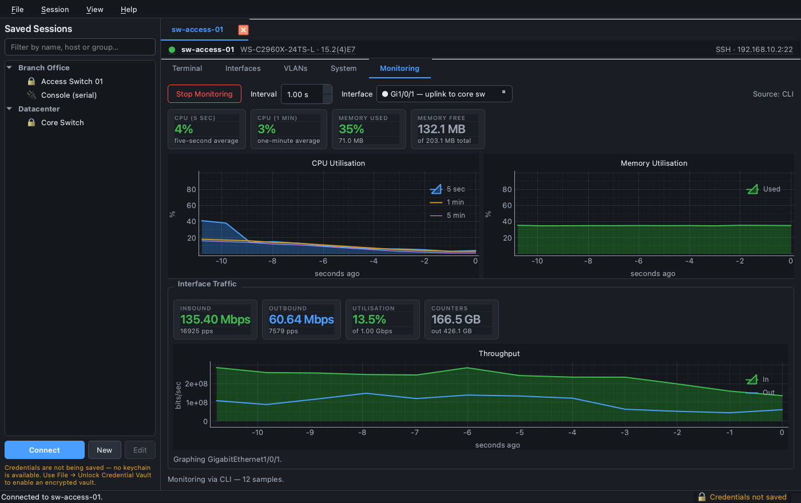
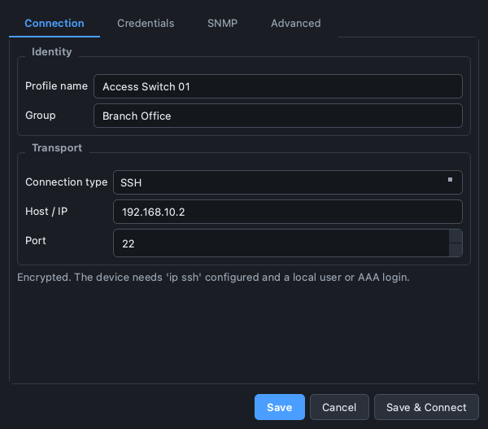
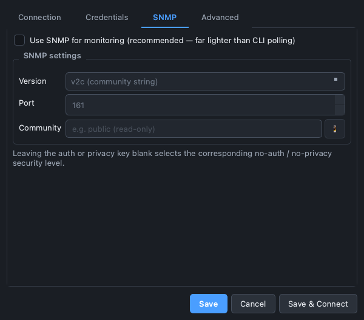

# CiscoIOSBox

A lightweight, WinBox-style desktop application for managing and monitoring Cisco
switches and routers. Connect over **SSH, Telnet or a serial console**, get an
integrated ANSI terminal, point-and-click VLAN and interface management, and live
CPU / memory / bandwidth graphs.

Built with **PySide6** (Qt 6) and **Netmiko**. Every network operation runs on a
background thread, so the interface never freezes waiting on a device.

---

## Table of contents

- [Features](#features)
- [Tour](#tour)
- [Requirements](#requirements)
- [Installation](#installation)
- [Running](#running)
- [Building a standalone executable](#building-a-standalone-executable)
- [Architecture](#architecture)
- [Credential storage](#credential-storage)
- [Monitoring: SNMP vs CLI](#monitoring-snmp-vs-cli)
- [Testing](#testing)
- [Troubleshooting](#troubleshooting)
- [Project layout](#project-layout)
- [Extending](#extending)
- [Licence](#licence)

---

## Features

### Connection management
- **SSH, Telnet and Serial/console** connections, all through one interface.
- **Session manager** — save device profiles (host, port, credentials, enable
  secret, platform, timeouts), organise them into groups, filter as you type,
  and connect with a double-click.
- **Serial port auto-detection** with a rescan button; configurable baud rate and
  framing (8-N-1 and friends).
- Legacy-device support: relaxed SSH algorithm negotiation for old IOS images
  that modern OpenSSH/paramiko refuse by default.

### Interactive terminal
- Integrated ANSI-capable terminal with 16-colour, xterm-256 and 24-bit true
  colour support.
- Correct terminal semantics — carriage-return overwrite, backspace editing and
  erase-line — so IOS's `--More--` paging and command-history recall render the
  way they do in PuTTY.
- Ctrl-key passthrough (`Ctrl+C` reaches the device as a break), arrow-key
  history, `Ctrl+Shift+C/V` for copy and paste, `Ctrl+scroll` to zoom.
- Bounded scrollback, so a stray `show tech-support` cannot exhaust memory.

### Quick config dashboard
- **Interfaces** — sortable grid merging `show ip interface brief`,
  `show interfaces status` and `show interfaces switchport`: status, admin state,
  description, VLAN, mode, duplex, speed, IP and media type. Multi-select and
  toggle **shutdown / no shutdown**, edit descriptions, filter, and jump straight
  to a traffic graph.
- **VLANs** — browse the VLAN database, create single VLANs or whole ranges
  (`10,20,30-35`), delete them, and assign ports to access or trunk mode with
  voice-VLAN, allowed-list and native-VLAN options.
- **System** — device facts (model, IOS version, serial, uptime), change the
  hostname, set the management IP / mask / default gateway, view and export the
  running configuration, and `write memory`.

### Monitoring
- Live **CPU** (5-second, 1-minute and 5-minute averages) and **memory**
  utilisation graphs.
- Per-interface **bandwidth graphs** with utilisation against nominal link speed.
- **SNMP v2c and v3** polling when configured (64-bit `ifHC*` counters give exact
  throughput), with automatic fallback to CLI polling.

### Reliability
- Typed error handling: authentication failures, timeouts, refused connections,
  serial-port conflicts, `% Invalid input`, and TACACS+ command-authorisation
  denials each produce a specific, actionable message.
- Writes are **verified, not assumed** — after a shutdown/no-shutdown the app
  re-reads the interface and reports the state the device actually reached.
- Destructive actions (bulk shutdown, VLAN deletion, changing the management IP
  you are connected through) require confirmation.

---

## Tour

**Session manager** — organised, filterable device profiles with SSH, Telnet
or serial connections:



**ANSI terminal** — connect to a device and work at the CLI just like PuTTY:



**Interfaces** — sortable grid with status, admin state, VLAN, mode, duplex,
speed, IP and media type, plus one-click `shutdown` / `no shutdown`:



**VLANs** — browse the VLAN database, create single VLANs or ranges, and
assign ports to access or trunk mode:



**System** — device facts, hostname, management IP / mask / gateway, and
running-config export:



**Monitoring** — live CPU, memory and per-interface bandwidth graphs:



The **session editor** stores credentials through the encrypted vault and
optionally enables SNMP polling for the device:





---

## Try it without a device

A stateful Cisco switch simulator is included, so you can explore the whole
application with no hardware:

```bash
python demo.py                  # launch the app against simulated devices
python demo.py --screenshots    # render every tab to ./demo_screenshots/
```

The simulator is **genuinely stateful**, not a canned recording:

- Shutting a port really marks it down — refresh and the device reports `disabled`.
- Creating a VLAN really adds it to the database, and assigning ports really moves them.
- Changing the hostname updates the prompt, the header and the tab label.
- The **Terminal tab is interactive** — type `show vlan brief`, `configure terminal`,
  `interface Gi1/0/5`, `shutdown`, `write memory`. Keystrokes echo, backspace
  works, and unknown commands get a proper `% Invalid input detected at '^' marker`.
- CPU and per-port traffic figures drift over time, so the graphs actually move.

Three devices are pre-loaded (an access switch over SSH, a core switch, and a
serial console) to show how the session manager groups and distinguishes them.

Things worth trying:

| Try this | What it demonstrates |
|---|---|
| Select several ports → **Shutdown** | Bulk action with a confirmation guard, then verified read-back |
| Double-click a port | Cross-view navigation into a live traffic graph |
| **Create VLAN…** → type `100-104` | Range parsing and partial-failure reporting |
| Right-click ports → *Assign VLAN* | Grid → VLAN tab hand-off with ports pre-selected |
| **System** tab, edit the IP | The "you are connected through this interface" guard |
| Type `show fooo` in the terminal | Typed IOS error handling |

## Requirements

- **Python 3.10 or newer** (developed and tested on 3.14)
- A Cisco device reachable over SSH, Telnet or serial
- Windows, macOS or Linux

---

## Installation

```bash
# 1. Clone
git clone https://github.com/DrZere/ciscoiosbox ciscoiosbox
cd ciscoiosbox

# 2. Create a virtual environment
python3 -m venv .venv
source .venv/bin/activate          # Windows: .venv\Scripts\activate

# 3. Install dependencies
pip install -r requirements.txt
```

### Smaller install (recommended)

`requirements.txt` pins the full `PySide6` package, which pulls in ~330 MB of Qt
modules this application never touches (WebEngine, 3D, multimedia). The app only
needs QtCore, QtGui and QtWidgets, so you can install the essentials instead and
save roughly two thirds of the download and disk footprint:

```bash
pip install PySide6-Essentials pyqtgraph numpy netmiko pyserial \
            textfsm ntc-templates keyring cryptography pysnmp
```

### Optional dependencies

| Package | Purpose | Without it |
|---|---|---|
| `pysnmp` | SNMP v2c/v3 monitoring | Monitoring falls back to CLI polling |
| `ntc-templates` | TextFSM parsing of `show` output | Built-in regex parsers are used |
| `keyring` | OS keychain credential storage | Encrypted vault or session-only storage |

The application degrades gracefully when any of these are missing — it tells you
what it fell back to rather than failing.

---

## Running

```bash
python run.py              # from a checkout
python run.py --verbose    # debug logging (includes netmiko/paramiko internals)
python run.py --version
```

If installed as a package:

```bash
pip install -e .
ciscoiosbox
```

Logs are written to the per-user config directory (see below) as
`ciscoiosbox.log`, rotating at 1 MB with 3 backups.

### First run

1. Click **New** in the sidebar.
2. Fill in the **Connection** tab — name, type (SSH/Telnet/Serial), host and port.
   For serial, click **Rescan** to enumerate attached COM ports.
3. Fill in the **Credentials** tab — username, password, and the **enable secret**
   if you want to make configuration changes.
4. *(Optional)* Enable **SNMP** for lighter-weight monitoring.
5. **Save & Connect**.

---

## Building a standalone executable

A PyInstaller spec is included. It bundles the ntc-templates data files, the
netmiko driver table and the keyring backends — all of which are resolved
dynamically at runtime and would otherwise be missing from the frozen build.

```bash
pip install pyinstaller
pyinstaller ciscoiosbox.spec
```

Output:

| Platform | Artifact |
|---|---|
| Windows | `dist/CiscoIOSBox.exe` |
| macOS | `dist/CiscoIOSBox.app` (and a plain binary) |
| Linux | `dist/CiscoIOSBox` |

### Build notes

- **Build on the target OS.** PyInstaller does not cross-compile; a Windows
  `.exe` must be built on Windows.
- **Antivirus false positives.** Single-file PyInstaller binaries that open
  network sockets are a classic heuristic trigger. UPX compression is disabled in
  the spec because it makes this markedly worse. For distribution, code-sign the
  binary.
- **Size.** Expect roughly 60–90 MB with `PySide6-Essentials`. Install the
  essentials package *before* building — the spec's `excludes` list cannot remove
  Qt libraries that PyInstaller has already collected as hard dependencies.
- **A directory build starts faster** than a single file, because the one-file
  build unpacks to a temp directory on every launch. To switch, replace the
  `EXE(...)` call's bundled arguments with a `COLLECT(...)` step.

Adding an icon: drop an `.ico` (Windows) or `.icns` (macOS) into `resources/` and
set `icon="resources/icon.ico"` in the spec's `EXE(...)` block.

---

## Architecture

The codebase follows an **MVVM** split. The rule that matters: `core/` and
`parsers/` never import Qt widgets, and `ui/` never performs network I/O.

```
      ┌──────────────────────────────────────────────────┐
      │  ui/          Views — widgets only, no I/O       │
      │  MainWindow, DeviceTab, InterfacesView, …        │
      └───────────────┬──────────────────────────────────┘
                      │ Qt signals / slots
      ┌───────────────▼──────────────────────────────────┐
      │  services/    ViewModels — build tasks, parse,    │
      │               re-emit as typed signals            │
      └───────────────┬──────────────────────────────────┘
                      │ submit(callable)
      ┌───────────────▼──────────────────────────────────┐
      │  core/connection.py                              │
      │  ConnectionController  (GUI thread)               │
      │        └── ConnectionWorker  (QThread) ◄── queue  │
      └───────────────┬──────────────────────────────────┘
                      │
      ┌───────────────▼──────────────────────────────────┐
      │  core/transport.py → netmiko_transport.py        │
      │  SSH · Telnet · Serial                            │
      └──────────────────────────────────────────────────┘
```

### The threading model

Each connected device owns **exactly one** `ConnectionWorker` on **one**
`QThread`. Every interaction — terminal keystrokes, `show` commands, config
pushes, monitoring polls — is submitted as a task onto that worker's priority
queue.

Because a single thread services the queue sequentially, access to the device
channel is serialised *by construction*. There are no locks around the transport,
and it is impossible for a structured command and a terminal keystroke to
interleave mid-read — a class of bug that is otherwise very hard to reproduce and
diagnose.

Keystrokes are submitted at priority 0 and monitoring polls at priority 7, so
typing stays responsive even while a slow poll is queued behind it.

This is enforced by tests rather than convention — see
`tests/test_connection.py::test_network_io_never_runs_on_the_calling_thread`,
which asserts the transport is touched by exactly one thread and never the
calling one.

### Parsing strategy

Every `show` command is parsed twice over: first with the community
**ntc-templates** TextFSM template, and if that is unavailable or matches
nothing, with a **hand-written regex parser**. This keeps the app working in a
stripped-down frozen build while still benefiting from ntc-templates when
present.

`show interfaces status` is parsed by **column offset** rather than whitespace
splitting, because descriptions contain spaces — splitting on whitespace shreds
`"uplink to core sw"` into four fields and misaligns every column after it.

---

## Credential storage

Two backends, selected automatically:

1. **OS keychain** (preferred) — macOS Keychain, Windows Credential Manager
   (DPAPI), Linux SecretService/KWallet. The operating system owns the encryption
   key and ties it to your login session; this application writes nothing
   sensitive itself.

2. **Encrypted vault file** — a Fernet-encrypted file used when no keyring is
   available (common on headless Linux and in some frozen builds). The key is
   derived from a master password using **scrypt** (N=2¹⁵, r=8, p=1) and is never
   written to disk. Unlock it via **File → Unlock Credential Vault**.

There is deliberately **no third "obfuscated" mode**. A vault whose key sits next
to it on disk provides no real protection while implying that it does, so if you
decline both backends, secrets are simply held in memory for the session and
discarded on exit. The status bar always shows which mode is active.

Saved profiles live in plain JSON — readable, diffable, easy to back up — and
never contain secrets.

**Config directory:**

| Platform | Path |
|---|---|
| Windows | `%APPDATA%\CiscoIOSBox\` |
| macOS | `~/Library/Application Support/CiscoIOSBox/` |
| Linux | `$XDG_CONFIG_HOME/CiscoIOSBox/` (default `~/.config/CiscoIOSBox/`) |

---

## Monitoring: SNMP vs CLI

| | SNMP (v2c/v3) | CLI |
|---|---|---|
| Device load | Very low | Moderate — a full command per poll |
| Throughput accuracy | Exact: 64-bit counter deltas over a known interval | Approximate: IOS's 5-minute weighted average |
| Burst visibility | Yes | No — short bursts are averaged away |
| Setup | Requires SNMP configured on the device | None |
| Works over serial | No (needs an IP) | Yes |

SNMP is used automatically when configured and reachable, with transparent
fallback to CLI. The active source is always shown in the monitoring tab.

To enable SNMP v2c on a device:

```
snmp-server community <string> RO
```

Monitoring stops itself after four consecutive failures rather than generating an
unbounded stream of error notifications from a device that has gone away.

---

## Testing

```bash
pip install pytest
QT_QPA_PLATFORM=offscreen pytest tests/ -q
```

109 tests covering:

- **`test_parsers.py`** — every parser against captured real device output,
  including edge cases: descriptions containing spaces, wrapped VLAN port lists,
  `administratively down` vs plain `down`, natural interface sort ordering
  (`Gi1/0/2` before `Gi1/0/10`), non-contiguous subnet masks, and distinguishing
  genuine `%` errors from benign `% Warning:` lines.
- **`test_ansi.py`** — escape parsing, including sequences split across two reads
  (which happens constantly on a slow serial line and is the most common way a
  naive terminal corrupts its output).
- **`test_connection.py`** — the threading guarantees, using a fake transport that
  records which thread touched it.

The `QT_QPA_PLATFORM=offscreen` variable lets the Qt tests run headless in CI.

---

## Troubleshooting

**"Authentication failed" but the credentials are correct**
Older IOS images negotiate SSH algorithms that modern paramiko disables. The app
already relaxes this, but if it persists try Telnet or console, or add
`ip ssh version 2` and regenerate the RSA key on the device.

**Commands time out on a slow link**
Raise **Command timeout** and **Delay factor** in the profile's Advanced tab, and
turn off **Fast CLI mode**.

**Serial port will not open**
Another program (PuTTY, screen, minicom) probably holds it. On Linux, add
yourself to the `dialout` group: `sudo usermod -aG dialout $USER`, then log out
and back in.

**"Requires privileged EXEC mode"**
The profile has no enable secret, or it is wrong. Read-only browsing and
monitoring still work; configuration changes do not.

**Interface grid is empty on a router**
Routers have no `show interfaces status`. The app detects this and falls back to
`show interfaces description` automatically — if the grid is still empty, check
that `show ip interface brief` returns output for your account.

**Garbled terminal output over serial**
Check the baud rate, and confirm flow control is off — Cisco consoles use none,
and enabling it is a classic cause of a hung console.

---

## Project layout

```
ciscoiosbox/
├── run.py                          # development entry point
├── requirements.txt
├── pyproject.toml
├── ciscoiosbox.spec                # PyInstaller build spec
├── README.md
├── src/ciscoiosbox/
│   ├── app.py                      # bootstrap: logging, Qt setup, entry point
│   ├── core/                       # MODEL — no Qt widget imports
│   │   ├── models.py               #   DeviceProfile, InterfaceRow, Vlan, …
│   │   ├── exceptions.py           #   typed error hierarchy
│   │   ├── transport.py            #   BaseTransport ABC
│   │   ├── netmiko_transport.py    #   SSH + Telnet + Serial
│   │   ├── connection.py           #   ConnectionWorker (QThread) + Controller
│   │   ├── credentials.py          #   keyring → encrypted-vault fallback
│   │   ├── session_store.py        #   profile persistence
│   │   └── snmp.py                 #   SNMP v2c/v3 with a private event loop
│   ├── parsers/                    # pure functions: str → dataclass
│   │   ├── errors.py               #   IOS rejection detection
│   │   ├── textfsm_parser.py       #   ntc-templates wrapper
│   │   ├── interfaces.py / vlans.py / system.py
│   ├── services/                   # VIEWMODEL — submit tasks, emit signals
│   │   ├── base.py
│   │   ├── interface_service.py / vlan_service.py
│   │   ├── system_service.py / monitor_service.py
│   └── ui/                         # VIEW — widgets only
│       ├── main_window.py / device_tab.py
│       ├── theme.py                #   palette + dark stylesheet
│       ├── ansi.py / terminal.py   #   escape parser + terminal widget
│       ├── session_manager.py / session_dialog.py
│       ├── interfaces_view.py / vlans_view.py / system_view.py
│       ├── monitor_view.py / graphs.py
│       └── widgets/toast.py
└── tests/
    ├── test_parsers.py
    ├── test_ansi.py
    └── test_connection.py
```

---

## Extending

**Add a new device platform.** Add an entry to `PLATFORMS` in
`ui/session_dialog.py`; netmiko handles the rest. If its output differs, add a
regex fallback to the relevant parser — the TextFSM path will already try the
matching ntc-template.

**Add a new dashboard tab.**
1. Add a service in `services/` subclassing `BaseService`, declaring its `kinds`.
2. Add a view in `ui/` that consumes only that service's signals.
3. Register both in `ui/device_tab.py`.

**Swap the transport.** Implement `core/transport.py::BaseTransport` and pass a
factory to `ConnectionController(profile, transport_factory=...)`. Nothing above
the transport layer changes — this is exactly how the test suite injects its
fake.

---

## Licence

MIT.

> **A word of caution.** This tool writes to production network devices. Changing
> the management IP of the interface you are connected through *will* drop your
> session — the app warns you before doing it, but over SSH there is no undo. Test
> against a lab device first.
